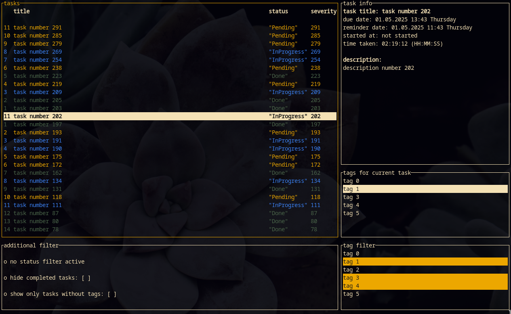
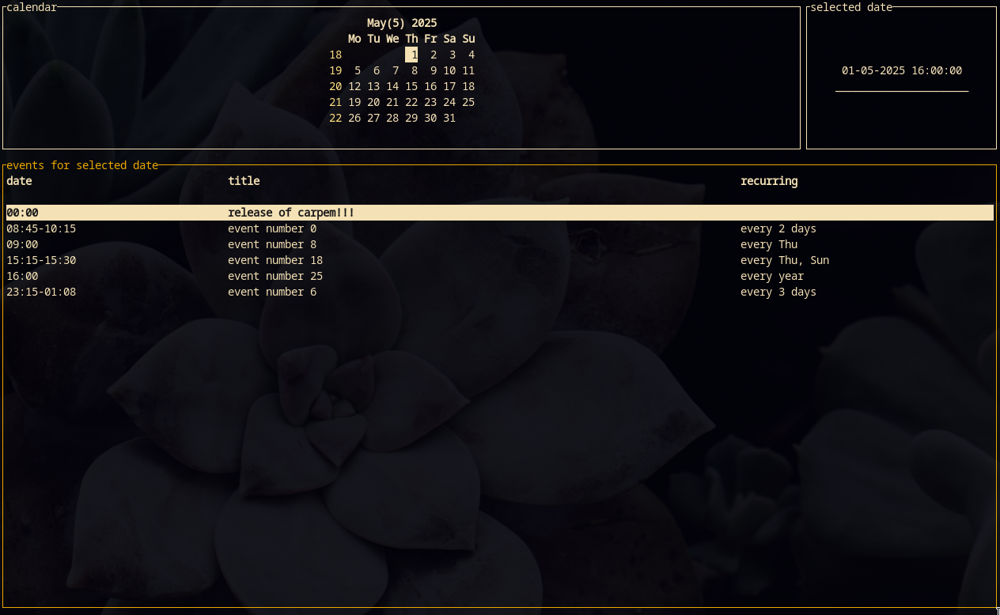

# carpem

**carpem** (from *carpe diem*) is a command-line task and event manager written in Rust. It helps you organize your day with powerful tagging, status management, and support for recurring events — all from your terminal.

## Features

- Add, delete, and update tasks
- Tag tasks with multiple labels
- Change task status:
  - `Backlog`
  - `Pending`
  - `InProgress`
  - `Testing`
  - `Done`
- Add one-time or recurring events
- Simple and fast CLI experience

## Demo and Screenshots

### Taskmanager


[tasks.webm](https://github.com/user-attachments/assets/ab2bc7df-19d1-4980-82a6-8f18a9be4e0d)

### Eventmanager


[events.webm](https://github.com/user-attachments/assets/05dccec6-a73a-4dce-bed9-064c7131d925)


## Build and Run


Build via Cargo:

```bash
cargo run --release
```
